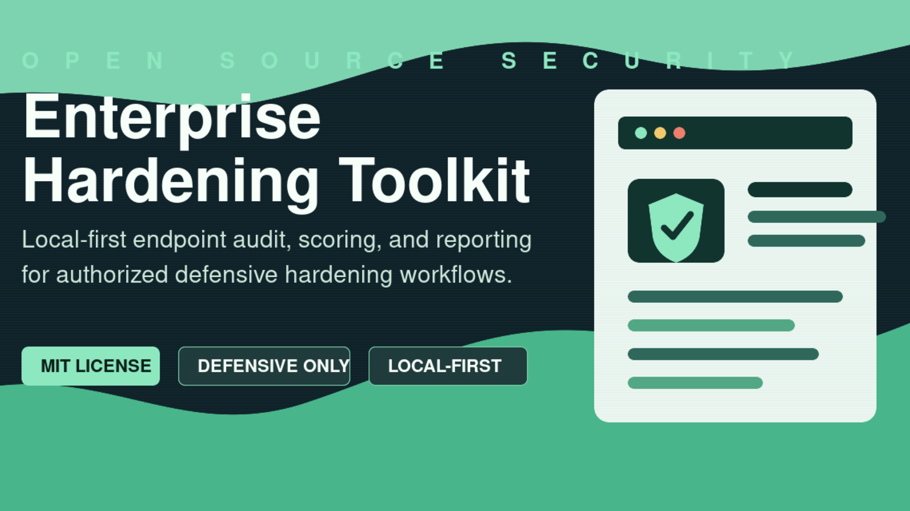

# Enterprise Hardening Toolkit



Defensive, local-first endpoint hardening audit and reporting toolkit for IT teams, MSPs, consultants, students, and compliance support teams.

The project helps turn endpoint hardening evidence into structured findings, severity scores, remediation guidance, and Markdown reports without collecting credentials or modifying systems automatically.

## Project Status

This repository is an open-source MVP. It is useful for local authorized audits, demonstrations, learning, and early service workflows. It is not yet an enterprise production platform.

## Included

- FastAPI backend
- SQLite local persistence
- YAML baseline loader
- Linux local read-only audit collector
- Windows PowerShell collector template
- Standard audit JSON importer
- Severity scoring
- Remediation guidance
- Markdown report export
- Sample audit data
- Unit tests and release verification script
- User manual, collector guide, troubleshooting guide, and architecture notes

## Safety Boundary

Use this toolkit only on systems you own or are explicitly authorized to assess.

This project does not include exploit code, credential collection, stealth, persistence, remote exploitation, auto-hardening, destructive cleanup, or unauthorized scanning.

Audit JSON and generated reports may contain sensitive system configuration evidence and must not be published publicly. Store audit inputs, databases, and reports in approved private locations only.

## Quick Start

```bash
python3 -m venv .venv
. .venv/bin/activate
pip install -r requirements.txt
uvicorn app.main:app --reload --host 127.0.0.1 --port 8000
```

## Generate Sample Report

```bash
python3 scripts/generate_sample_report.py
```

The generated report is written to `reports/`.

## One-Command Demo

```bash
python3 scripts/run_demo.py
```

Expected output includes:

```text
DEMO_STATUS=PASS
REPORT_GENERATED=true
```

## Run Tests

```bash
python3 -m unittest discover -s tests -v
```

## Documentation

- `START_HERE.md`
- `docs/USER_MANUAL.md`
- `docs/COLLECTOR_GUIDE.md`
- `docs/TROUBLESHOOTING.md`
- `docs/ARCHITECTURE.md`
- `SECURITY.md`
- `CONTRIBUTING.md`

## API

- `GET /health`
- `GET /baselines`
- `POST /clients`
- `POST /devices`
- `POST /audits/import`
- `POST /reports/{audit_id}`

## Roadmap

- Web dashboard
- PDF export
- audit history comparison
- authentication and RBAC
- encrypted local storage
- signed audit logs
- installer workflow
- broader endpoint coverage

## Standard Audit JSON

Collectors must output:

- `scan_id`
- `hostname`
- `os_family`
- `os_version`
- `timestamp`
- `checks[]`

Each check must include:

- `check_id`
- `category`
- `name`
- `status`
- `current_value`
- `recommended_value`
- `severity`
- `evidence`
- `remediation`
- `compliance_mappings`

## License

MIT. See `LICENSE`.
